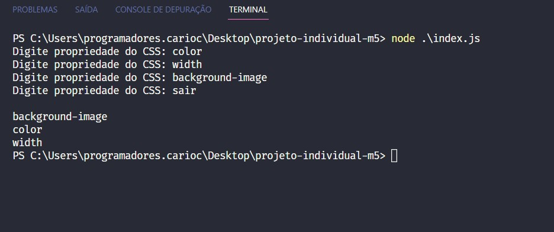
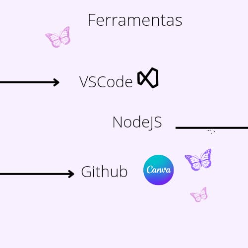

  

<h2 id="sobre">O Projeto:</h2>

<h4>
 Na Criação de um código usando o NodeJS que  recebera uma lista de propriedades CSS e irá retornar a mesma lista de forma ordenada . O código irá rodar em um laço que vai receber propriedades até que seja digitada a palavra “SAIR” para que encerrar .
</h4>

<h2 id="projeto"> Resultado:</h2>

  

<h2 id="ferramentas">Ferramentas utilizadas no Projeto 5📘 </h2>
 

 

  &#11165;&nbsp;<a href="#topo"><strong>Voltar ao topo</strong></a>&nbsp;&#11165;

